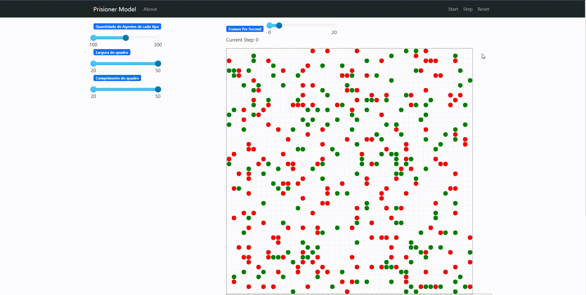
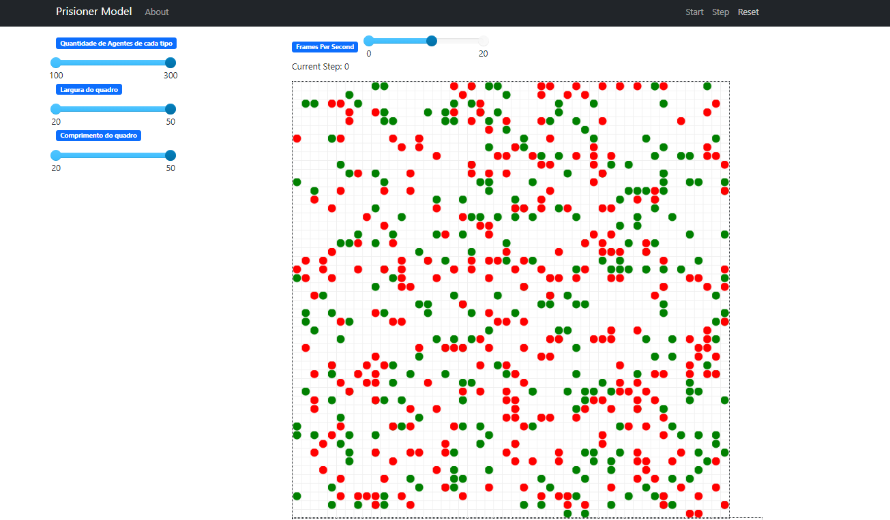
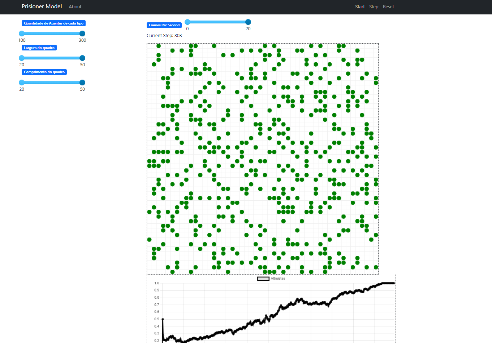

# Simulador de Delação Premiada

**Disciplina**: FGA0210 - PARADIGMAS DE PROGRAMAÇÃO - T01 <br>
**Grupo**: 02<br>
**Paradigma**: SMA<br>

## Alunos

| Matrícula  | Aluno                            |
| ---------- | -------------------------------- |
| 18/0108344 | Rafael Berto Pereira             |
| 19/0016663 | Lucas Pimentel Quintão           |
| 19/0044403 | Victor Souza Dantas Martins Lima |
| 20/0017519 | Eurico Menezes de Abreu Neto     |
| 19/0033088 | Lucas Braun Vieira Xavier        |
| 19/0055201 | Matheus Calixto Vaz Pinheiro     |

## Sobre

Neste projeto, nossa equipe explorou o conceito do "Dilema do Prisioneiro" e desenvolveu uma simulação de delação premiada.<br>

O "Dilema do Prisioneiro" é um problema clássico na teoria dos jogos que examina a cooperação e a traição em situações de interação entre dois indivíduos. No contexto da delação premiada, o dilema surge quando dois suspeitos de um crime são interrogados separadamente e têm a oportunidade de decidir se irão cooperar com o outro suspeito, permanecendo em silêncio, ou trair o outro, delatando-o à polícia, como detalhado abaixo:

"Dois suspeitos, A e B, são presos pela polícia. A polícia tem provas insuficientes para os condenar, mas, separando os prisioneiros, oferece a ambos o mesmo acordo: se um dos prisioneiros, confessando, testemunhar contra o outro e esse outro permanecer em silêncio, o que confessou sai livre enquanto o cúmplice silencioso cumpre 10 anos de sentença. Se ambos ficarem em silêncio, a polícia só pode condená-los a 6 meses de cadeia cada um. Se ambos traírem o comparsa, cada um leva 5 anos de cadeia. Cada prisioneiro faz a sua decisão sem saber que decisão o outro vai tomar, e nenhum tem certeza da decisão do outro. A questão que o dilema propõe é: o que vai acontecer? Como o prisioneiro vai reagir?"

|                        |           Prisioneiro "B" nega           |          Prisioneiro "B" delata          |
| ---------------------- | :--------------------------------------: | :--------------------------------------: |
| Prisioneiro "A" nega   |      Ambos são condenados a 6 meses      | "A" é condenado a 10 anos; "B" sai livre |
| Prisioneiro "A" delata | "A" sai livre, "B" é condenado a 10 anos |      Ambos são condenados a 5 anos       |

Nosso projeto consiste em uma simulação desse cenário, onde os suspeitos são representados por agentes de software. Os agentes podem tomar decisões de cooperação ou traição.<br>

A simulação começa com metade dos agentes dispostos a trair e metade dispostos a cooperar, chamamos estes de agentes egoístas e altruístas, respectivamente. Então, em cada rodada, cada agente interage uma vez com cada vizinho seu, traindo ou cooperando. Após essa interação, o prisioneiro assume a estratégia(trair ou cooperar) do seu vizinho que está com o menor tempo de cadeia. Por fim, cada agente assume a posição de um de seus vizinhos. Dessa forma, podemos saber qual a estratégia que irá trazer um melhor resultado a longo prazo.

Para auxiliar na visualização da estratégia predominante, adicionamos um gráfico que faz o cálculo em tempo real do "Índice de Altruísmo", que se refere a porcentagem de prisioneiros que optaram por não delatar seus comparsas naquela rodada.

## Screenshots







## Instalação

**Linguagens**: Python 3<br>
**Tecnologias**: Framework MESA<br>

Para instalar o framework MESA basta rodar o comando

```
pip install mesa
```

## Uso

### Como executar

1 - Clone este repositório em sua máquina local.<br>
2 - Execute o arquivo principal main.py utilizando o interpretador Python.

```
python main.py
```

3 - Acompanhe a simulação em http://127.0.0.1:8521

## Vídeo

Adicione 1 ou mais vídeos com a execução do projeto.
Procure:
(i) Introduzir o projeto;
(ii) Mostrar passo a passo o código, explicando-o, e deixando claro o que é de terceiros, e o que é contribuição real da equipe;
(iii) Apresentar particularidades do Paradigma, da Linguagem, e das Tecnologias, e
(iV) Apresentar lições aprendidas, contribuições, pendências, e ideias para trabalhos futuros.
OBS: TODOS DEVEM PARTICIPAR, CONFERINDO PONTOS DE VISTA.
TEMPO: +/- 15min

## Participações

Apresente, brevemente, como cada membro do grupo contribuiu para o projeto.
|Nome do Membro | Contribuição | Significância da Contribuição para o Projeto (Excelente/Boa/Regular/Ruim/Nula) |
| -- | -- | -- |
| Rafael Berto Pereira | Eu contribuí no desenvolvimento dos Agentes em conjunto com o Brenno e o Matheus. No começo senti dificuldade no uso do construtor dos agentes. Após essa dificuldade superada, ajudei a programar o comportamento dos agentes. Inicialmente tinha pensado em três comportamentos flexível, autruista e egoísta. Entretanto, com o tempo percebeu que o flexível sempre ganhava a longo prazo. Além disso não tinha como saber se ele ganhoou porque foi autruista ou egoista. Achei esse paradigma muito interessante ver que cada agente tinha um comportamento independente. Além disso, o uso do Framework MESA, em python, facilitou bastante a curva de aprendizado | Boa |
|Lucas Pimentel | Ajudei a equipe na idealização do projeto e na pesquisa de base teórica para a realização dele. Além disso, atuei em conjunto com o Victor Lima e o Eurico Abreu na implementação da classe Model. Também consegui auxiliar no desenvolvimento do Agente em si, revisando a lógica implementada e fazendo algumas alterações. Acredito que este trabalho tenha sido de grande importância para a compreensão do paradigma, por mais que o framework utilizado abstraia alguns dos desafios impostos pelo paradigma SMA. | Excelente |
| Eurico Abreu | Durante essa entrega contribui no código e na organização geral do projeto (reuniões, decisões do que fazer e etc). Relacionado ao código, trabalhei em conjunto com o Lucas Pimentel e com o Victor Lima, na implementação da classe Model. Foi um ótimo projeto para fixar e colocar em prática os conceitos do paradigma estudado. Gostaria de ter participado mais no projeto, no entanto devido a problemas de saúde não foi possível. | Boa |
| Lucas Braun | Minha maior contribuição foi no gráfico da razão de agentes autruístas a cada passo da simulação. Achei esse um paradigma interessante, e não tive dificuldades em entender e utilizar o framework MESA, principalmente por ser em Python, mas também por sua documentação não ser tão ruim e existirem diversos exemplos de uso na internet. | Boa |
| Victor Lima| Atuei juntamente com o Lucas Pmientel e o Eurico Abreu na model do projeto, posteriormente atuei com o Lucas para realizar a modularização do projeto e adição dos botões que controlam o tamanho e do grid e a quantidade de agentes. Acredito que o trabalho foi bom para compreensão do paradigma e que o framework MESA facilitou bastante a implementação | Boa |
| Gustavo Martins Ribeiro | Participação ativa das reuniões de definição de escopo e das reuniões de desenvolvimento; Auxilio geral e elaboração do Gráfico de Linhas contendo a porcentagem de autruistas em relação ao total de agentes. | Excelente |
| Matheus Calixto Vaz Pinheiro | Minha participação no projeto foi no desenvolvimento dos Agentes em conjunto do Brenno e do Rafael. Gostei bastante do desenvolvimento pois pude aprender junto do Rafael e Brenno, pois entramos em call no discord e utilizamos o live share para que conseguissemos escrever o código paralelamente, isto também fez com que a todo momento os três se juntassem para pensar em como definir cada aspecto do código e o comportamento do mesmo. De inicio erramos colocando um tipo a mais de Agente o que fez com que o "Dilema do Priosioneiro" não fosse devidamente representado, mas após a retirada do mesmo tivemos uma ótima simulação. No mais achei o paradigma interessantíssimo e o uso do framework MESA muito bom por sua curva de aprendizagem baixa. | Boa | 

Quaisquer outras informações sobre o projeto podem ser descritas aqui. Não esqueça, entretanto, de informar sobre:
(i) Lições Aprendidas;
(ii) Percepções;
(iii) Contribuições e Fragilidades, e
(iV) Trabalhos Futuros.

## Fontes

[Dilema do prisioneiro - WikiPédia](https://pt.wikipedia.org/wiki/Dilema_do_prisioneiro)
